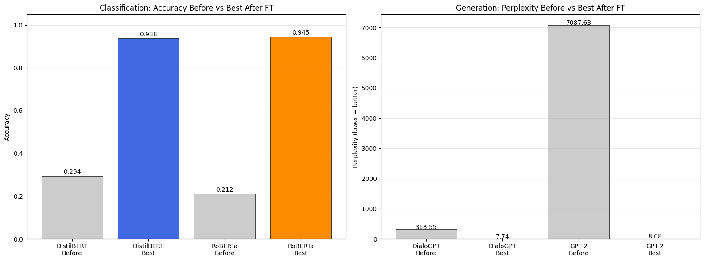
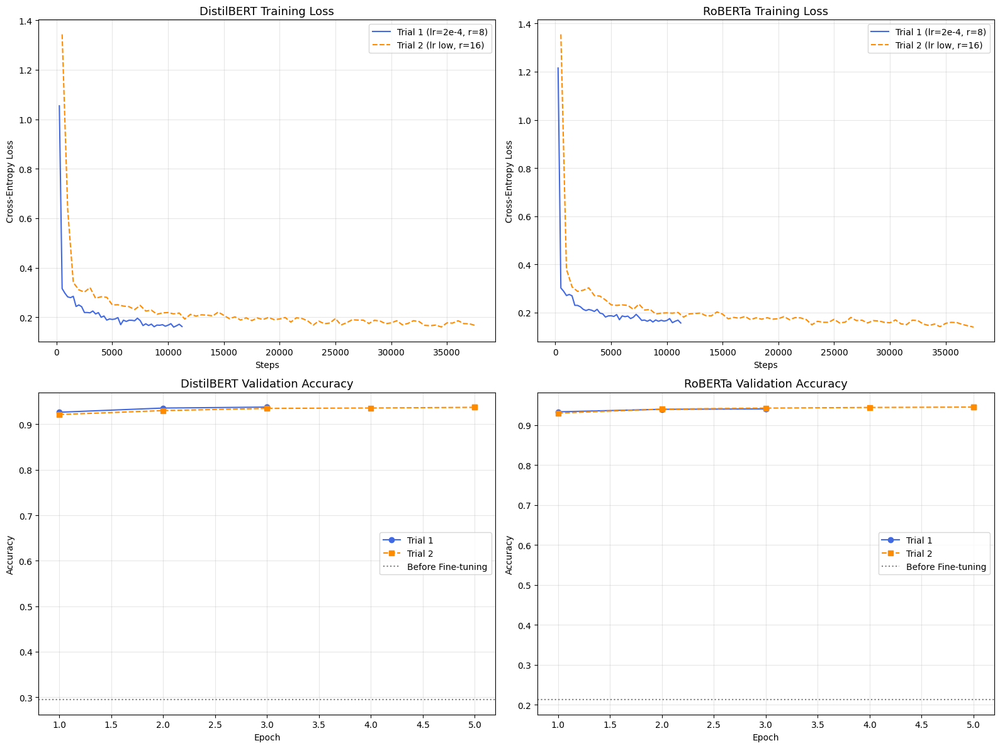
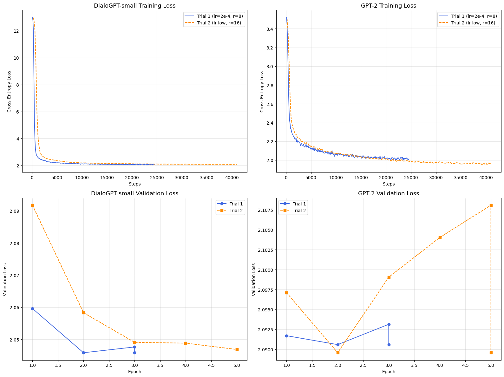

# LoRA Fine-Tuning of LLMs for Classification and Generation

 

Parameter-efficient fine-tuning (LoRA via Hugging Face `peft`) of four open models on two tasks, with multiple hyper-parameter trials and before/after comparisons.

| Task | Dataset | Models |
|---|---|---|
| News topic classification (4 classes) | AG News (120k train / 7.6k test) | DistilBERT-base (66M), RoBERTa-base (125M) |
| Persona-conditioned dialogue generation | PersonaChat (~17.9k conversations) | DialoGPT-small, GPT-2 |

## Results



| Model | Metric | Before | Best after LoRA |
|---|---|---|---|
| DistilBERT + LoRA | Test accuracy | 0.294 | **0.938** |
| RoBERTa + LoRA | Test accuracy | 0.212 | **0.945** |
| DialoGPT-small + LoRA | Perplexity | 318.55 | **7.74** (ROUGE-L 0.145) |
| GPT-2 + LoRA | Perplexity | 7087.63 | **8.08** (ROUGE-L 0.152) |

Hyper-parameter trials (r = 8 vs 16, different learning rates and epochs) are compared in the notebook.



### Honest caveats

- "Before" classification accuracy is a randomly initialised classification head, and "before" perplexity is for base models that have never seen the `[PERSONA] / [HISTORY] / [RESPONSE]` prompt format, so the improvements show format adaptation and are not like-for-like quality gains.
- Between trials, differences are small (e.g. DialoGPT perplexity 7.74 in both). On GPT-2, validation loss in the longer trial rises slightly, a sign of mild over-fitting.
- Sampled dialogue outputs still show repetition. Perplexity and ROUGE do not capture persona consistency, so a human or LLM-judge evaluation would be the next step.



## Run it

Developed on Google Colab (T4, 16 GB). Tested library versions are pinned in `requirements.txt`.

```bash
pip install -r requirements.txt
jupyter notebook notebooks/lora_finetuning_classification_and_generation.ipynb
```

Datasets download automatically from the Hugging Face Hub. Model weights and checkpoints are not committed.

## Skills demonstrated

PEFT/LoRA, Hugging Face Transformers, PyTorch, hyper-parameter search, evaluation (accuracy, perplexity, ROUGE), experiment visualisation.

## Background

Originally built for the *Large Language Models and Applications* course at Adelaide University and cleaned up for portfolio use. Assignment briefs and rubrics are not included.

## Author

Akshay Kumar Gandla. Released under the [MIT License](LICENSE).
